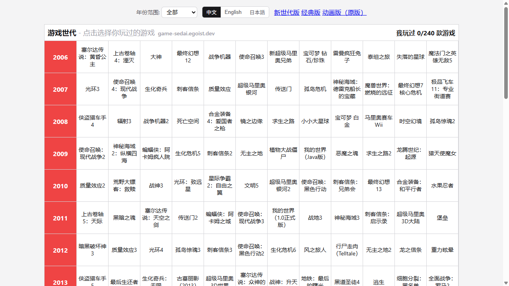
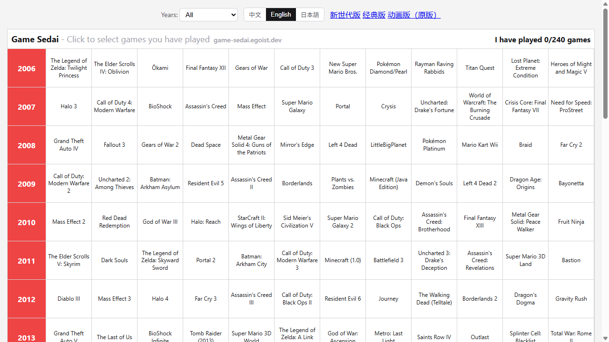
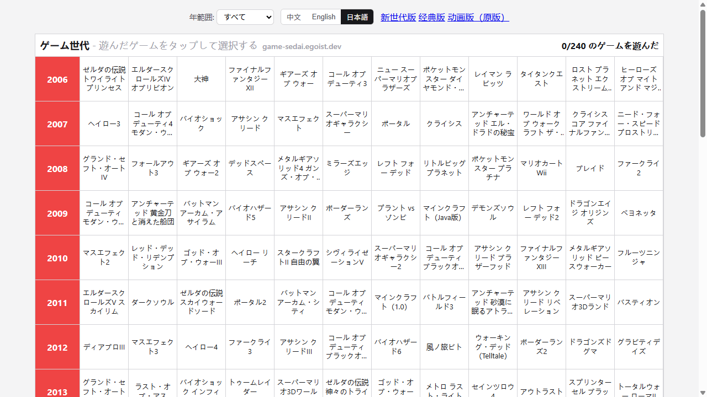
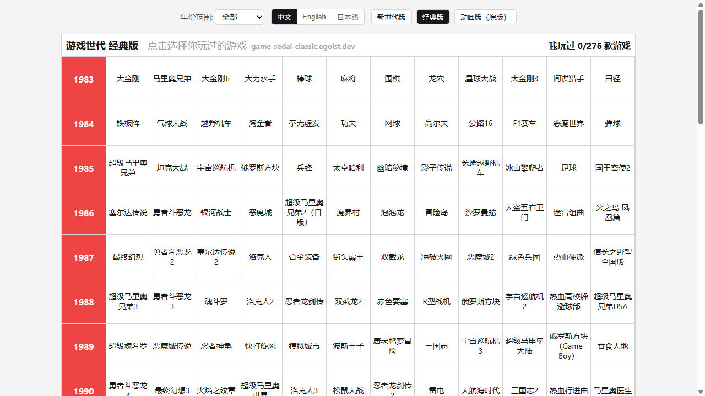
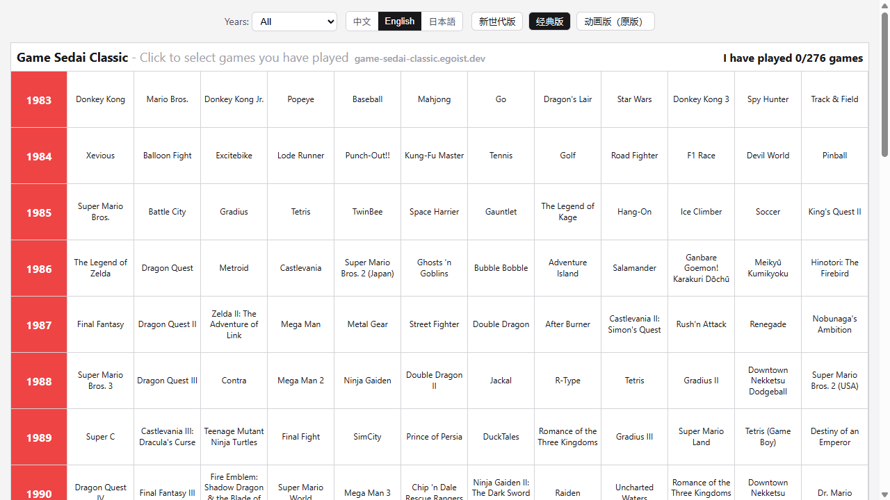
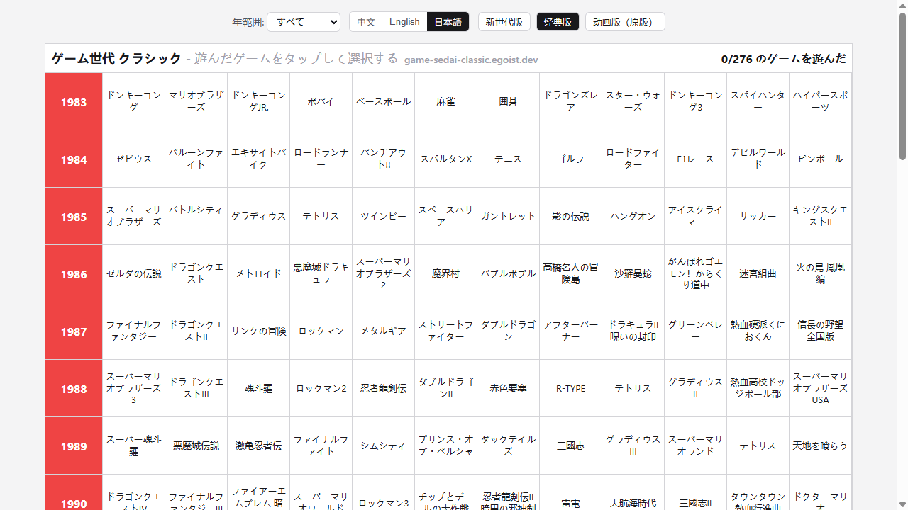

# Game Sedai

A game-themed single-page site (fork of anime-sedai) with Chinese / English / Japanese language switching, covering two eras: the New Generation (2006–2025) and the Classic era (1983–2005).

## Play Online

- New Generation (2006–2025): https://kaws3664.github.io/game-sedai/game-sedai.html
- Classic (1983–2005): https://kaws3664.github.io/game-sedai/game-sedai-classic.html

## Screenshots

### New Generation (2006–2025)

| 中文 | English | 日本語 |
| --- | --- | --- |
|  |  |  |

### Classic (1983–2005)

| 中文 | English | 日本語 |
| --- | --- | --- |
|  |  |  |

## Development

To install dependencies:

```bash
bun install
```

To run:

```bash
bun dev
```
